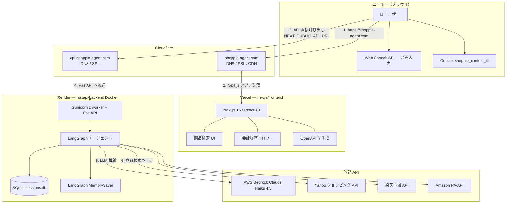
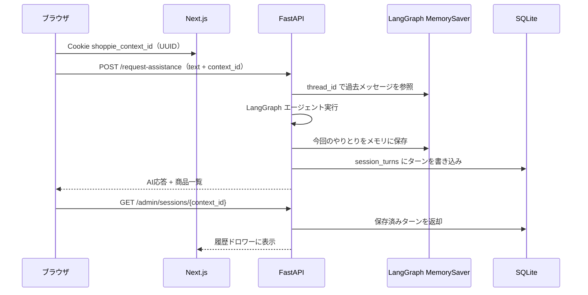

# Shoppie（ショッピー）｜話すだけで、買い物が進む

## Shoppieとは

**Shoppie** は、店員との会話のように自然な対話で商品を探せる
**音声ショッピングアプリ**です。
検索や操作の手間をなくし、話しかけるだけで商品が見つかります。

---

## 従来のショッピングが抱える課題

* 検索やカテゴリ選択など、手動操作が多く煩雑
* 欲しいものが曖昧だと、探しにくい
* スマートフォンやPCの操作が苦手な人には使いにくい
* 高齢者や視覚に不安のある人にとって情報取得のハードルが高い

---

## Shoppieによる解決

* 音声だけで商品検索が完結
* 曖昧なニーズにも自然言語で対応
* ボタン操作・タイピング不要のシンプルなUI
* LangChainによる文脈理解で、発言の流れを把握して提案

---

## 機能の特徴

* 音声による商品検索
  例：「洗えるスニーカーある？」など自然な会話形式で検索可能

* LangChainによる対話制御
  会話の意図や前後関係を理解し、カテゴリ提案や商品比較も実行

---

## アプリ名の由来

「Chatty（おしゃべり）」と「Shopping（買い物）」を組み合わせた造語。
会話しながら買い物を楽しめる体験を表現しています。

---

## 技術構成

### リポジトリ構成

```
Shoppie/
├── nextjs/frontend/   # Next.js（Vercel デプロイ）
└── fastapi/backend/   # FastAPI + LangGraph（Render デプロイ）
```

### 構成図



### 主な技術スタック

| レイヤー | 技術 |
|---------|------|
| フロントエンド | Next.js 15, React 19, Tailwind CSS, Web Speech API |
| バックエンド | FastAPI, LangGraph, Gunicorn, SQLite（会話履歴永続化） |
| LLM | AWS Bedrock — Claude Haiku 4.5 |
| 商品検索 | Yahoo!ショッピング / 楽天市場 / Amazon PA-API |
| フロント配信 | Vercel（Root Directory: `nextjs/frontend`） |
| API 配信 | Render（Docker、`fastapi/backend`） |
| エッジ | Cloudflare（DNS / SSL / CDN） |
| 型定義 | OpenAPI → `openapi-typescript`（`npm run gen`） |

### API 通信

フロントエンドは Next.js の API Routes を使わず、ブラウザから FastAPI を直接呼び出します。

| エンドポイント | 用途 |
|--------------|------|
| `POST /request-assistance` | 商品検索・AI応答 |
| `GET /admin/sessions/{id}` | 会話履歴取得 |
| `DELETE /admin/sessions/{id}` | チャットリセット |

### 会話履歴の永続化

会話データは **2層** で保持されます。役割が異なるため、どちらも使っています。



#### 1. セッションID（フロントエンド）

- ブラウザの Cookie `shoppie_context_id` に UUID を保存（有効期限 7 日）
- 検索のたびに `context_id` として API に送信され、バックエンドでは `thread_id` として扱われる
- 「新しい会話」リセット時は Cookie を新しい UUID に差し替え、旧セッションを `DELETE /admin/sessions/{id}` で削除

#### 2. LangGraph MemorySaver（エージェントの文脈）

- LangGraph の **インメモリチェックポイント**（`MemorySaver`）
- `thread_id` ごとに LLM への入力履歴（HumanMessage など）を保持し、前の発言を踏まえた応答を生成する
- **プロセス内メモリ**のため、サーバー再起動で消える
- Gunicorn は **ワーカー数 1**（`Dockerfile`）で運用し、同一プロセス内でのメモリ共有を担保

#### 3. SQLite SessionStore（表示用の会話履歴）

- ファイル: `fastapi/backend/data/sessions.db`（環境変数 `SESSION_STORE_PATH` で変更可）
- テーブル構成:
  - `sessions` — セッションID・作成日時・最終アクセス
  - `session_turns` — ユーザー発言・AI応答・商品プレビュー（タイトル・価格）
- 検索完了のたびに `record_turn()` で 1 ターンずつ追記
- フロントの履歴ドロワーは `GET /admin/sessions/{id}` でこのデータを取得して表示

#### 永続化の注意点（本番 Render）

| 項目 | 内容 |
|------|------|
| SQLite | コンテナのローカルディスクに保存。再デプロイ・再起動で消える可能性がある |
| 推奨設定 | Render の Persistent Disk をマウントし、`SESSION_STORE_PATH=/data/sessions.db` を設定 |
| インスタンス数 | **1 インスタンス**推奨（MemorySaver がプロセス内のため） |

