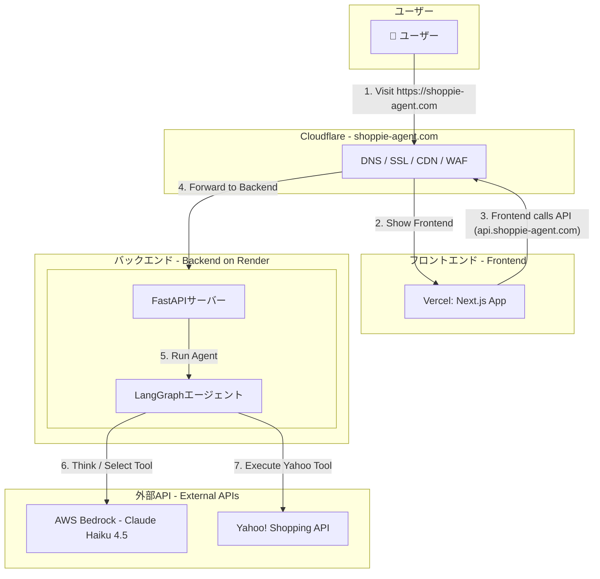

# Shoppie（ショッピー）｜話すだけで、買い物が進む

## Shoppieとは

**Shoppie** は、店員との会話のように自然な対話で商品を探せる
**音声ショッピングアプリ**です。
検索や操作の手間をなくし、話しかけるだけで商品が見つかります。

---

## 従来のショッピングが抱える課題

* 検索やカテゴリ選択など、手動操作が多く煩雑
* 欲しいものが曖昧だと、探しにくい
* スマートフォンやPCの操作が苦手な人には使いにくい
* 高齢者や視覚に不安のある人にとって情報取得のハードルが高い

---

## Shoppieによる解決

* 音声だけで商品検索が完結
* 曖昧なニーズにも自然言語で対応
* ボタン操作・タイピング不要のシンプルなUI
* LangChainによる文脈理解で、発言の流れを把握して提案

---

## 機能の特徴

* 音声による商品検索
  例：「洗えるスニーカーある？」など自然な会話形式で検索可能

* LangChainによる対話制御
  会話の意図や前後関係を理解し、カテゴリ提案や商品比較も実行

---

## アプリ名の由来

「Chatty（おしゃべり）」と「Shopping（買い物）」を組み合わせた造語。
会話しながら買い物を楽しめる体験を表現しています。

---

## 技術構成

