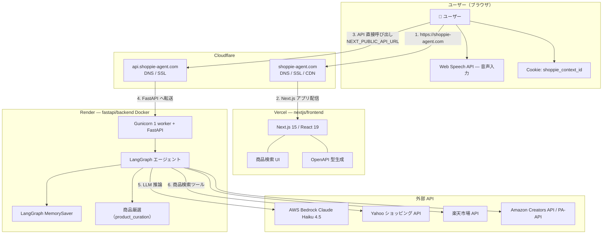
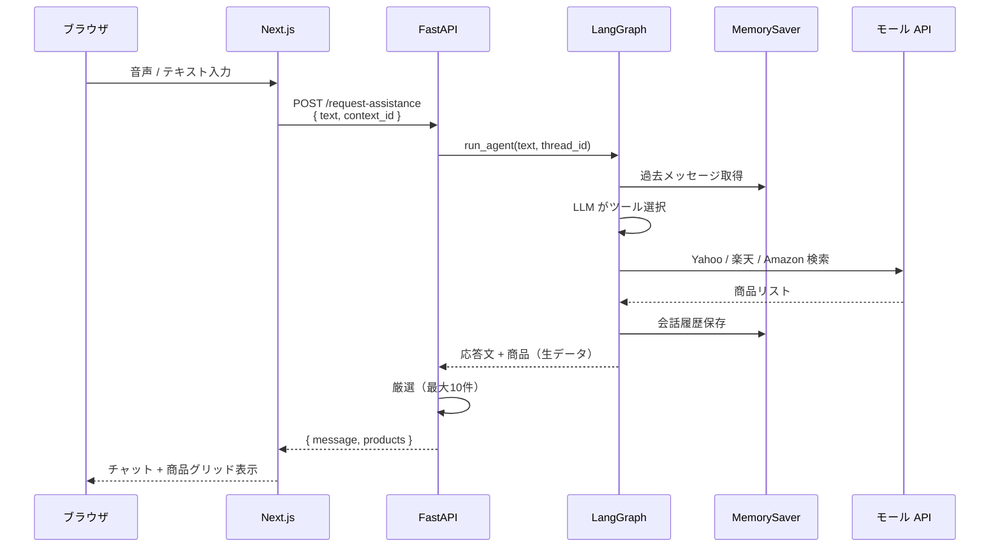

# アーキテクチャ概要

## Shoppie とは（技術視点）

Shoppie は、ユーザーが音声またはテキストで話しかけると、**LangGraph エージェント**が意図を理解し、複数の EC モール API から商品を検索して返す Web アプリです。

- **フロントエンド**: Next.js（Vercel）
- **バックエンド**: FastAPI + LangGraph（Render / Docker）
- **LLM**: AWS Bedrock — Claude Haiku 4.5
- **商品検索**: Yahoo!ショッピング / 楽天市場 / Amazon（Creators API / PA-API）

## システム構成図



## リクエストの流れ



## 技術スタック

| レイヤー | 技術 |
|---------|------|
| フロントエンド | Next.js 15, React 19, Tailwind CSS 4, Web Speech API |
| バックエンド | FastAPI, LangGraph, LangChain AWS, Gunicorn |
| LLM | AWS Bedrock — `anthropic.claude-haiku-4-5-20251001-v1:0` |
| 商品検索 | Yahoo v3 / 楽天 Ichiba / Amazon Creators API（PA-API 後方互換） |
| フロント配信 | Vercel（Root Directory: `nextjs/frontend`） |
| API 配信 | Render（Docker、`fastapi/backend`） |
| エッジ | Cloudflare（DNS / SSL / CDN） |
| 型定義 | OpenAPI → `openapi-typescript`（`npm run gen`） |

## API 通信方針

フロントエンドは **Next.js の API Routes を使わず**、ブラウザから FastAPI を直接呼び出します（CORS 設定済み）。

| エンドポイント | 用途 |
|--------------|------|
| `POST /request-assistance` | 商品検索・AI 応答 |
| `DELETE /context/{id}` | 会話文脈のリセット |
| `POST /chat` | （レガシー）チャット用 |

## ディレクトリ構成

```
Shoppie/
├── docs/                           # 技術ドキュメント
├── README.md                       # プロダクト概要
├── nextjs/frontend/
│   ├── app/                        # App Router（page.tsx がメイン UI）
│   ├── components/                 # UI コンポーネント
│   ├── hooks/                      # use-search, use-speech-recognition 等
│   ├── lib/                        # API クライアント、ログ
│   └── types/                      # OpenAPI 生成型
└── fastapi/
    ├── .env.sample
    ├── docker-compose.yml
    └── backend/
        ├── main.py                 # 起動エントリ
        ├── adapter/                # HTTP コントローラ・プレゼンター
        ├── domain/entities/        # Product, AgentResponse 等
        ├── usecase/                # ビジネスロジック
        └── infrastructure/
            ├── gateways/
            │   ├── langgraph/      # LangGraph エージェント
            │   ├── yahoo/
            │   ├── rakuten/
            │   └── amazon/
            ├── product_curation.py # 商品厳選
            ├── marketplace_config.py
            └── router/fastapi.py   # ルート定義
```
