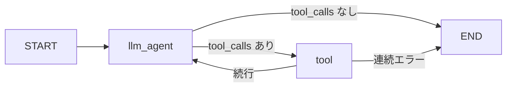

# LangGraph エージェント

## 概要

Shoppie の中核は `fastapi/backend/infrastructure/gateways/langgraph/langgraph_agent.py` にある **LangGraph ステートマシン**です。

ユーザーの発言を受け取り、AWS Bedrock 上の Claude Haiku 4.5 がツール（商品検索）を選び実行し、自然な日本語で応答を返します。

## 処理フロー



1. **発話入力** — `run_agent(user_input, thread_id)` が呼ばれる
2. **履歴参照** — `MemorySaver` から `thread_id` 単位の過去メッセージを取得
3. **LLM 推論** — システムプロンプト + 履歴 + 今回の入力で Bedrock を呼び出し
4. **ツール実行** — `tool_calls` があれば Yahoo / 楽天 / Amazon の検索ツールを実行
5. **ループ** — ツール結果を LLM に渡し、再度推論（最大数回）
6. **出力** — 最終応答文と、マージされた商品リストを返却

## グラフ定義

```python
graph = StateGraph(State)
graph.add_node("llm_agent", llm_node)
graph.add_node("tool", tool_node)
graph.add_edge(START, "llm_agent")
graph.add_conditional_edges("llm_agent", tools_condition, ...)
graph.add_conditional_edges("tool", route_after_tool, ...)
```

- `llm_node`: `ChatBedrock` + `bind_tools(SHOPPING_TOOLS)` で推論
- `tool_node`: LangGraph の `ToolNode` がツールを実行
- `route_after_tool`: 連続で空/エラーのツール結果が続いたら早期終了

## 登録ツール

| ツール名 | モール | 実装 |
|---------|--------|------|
| `search_yahoo_products_with_filters_tool` | Yahoo!ショッピング | `yahoo_tool_wrappers.py` |
| `search_rakuten_products_with_filters_tool` | 楽天市場 | `rakuten_tool_wrappers.py` |
| `search_amazon_products_with_filters_tool` | Amazon.co.jp | `amazon_tool_wrappers.py` |

環境変数が未設定のモールは、プロンプト上で利用不可として扱われます（`marketplace_config.py`）。

## 検索ポリシー（システムプロンプト）

| ユーザーの言い方 | エージェントの動き |
|----------------|------------------|
| 「黒いシューズ探して」（モール指定なし） | **利用可能な全モール**のツールを並列実行 |
| 「楽天で探して」 | 楽天ツールのみ |
| 「Amazonで」 | Amazon ツールのみ |
| 「他でも探して」「どこが安い」 | 利用可能な全モール |

- モールを聞き返すことは禁止（「どちらがよいですか」など）
- 商品名が分かれば即検索
- 返答文は短く（1〜3 文、120 字以内）。商品詳細は画面のカードに任せる

## 会話メモリ（MemorySaver）

```python
from langgraph.checkpoint.memory import MemorySaver
memory = MemorySaver()
graph = graph.compile(checkpointer=memory)
```

- `thread_id` = フロントエンドの `context_id`（Cookie `shoppie_context_id`）
- **プロセス内メモリ** — サーバー再起動で消える
- **永続化なし** — DB / Redis は使わない
- Gunicorn は **ワーカー数 1**（`Dockerfile`）— 複数ワーカーだとメモリが共有されないため

## ツール結果のマージ

複数ツールの結果は `merge_tool_content` で **リストとして連結**されます。

```python
def merge_tool_content(current, new_content):
    if isinstance(new_content, list):
        if isinstance(current, list):
            return current + new_content
        return new_content
```

`error` キーを含む dict はマージされません。

## 商品の厳選（エージェント外）

エージェントは各モールから生の検索結果を返します。**表示件数の絞り込み**は `usecase/request_assistance.py` → `product_curation.py` で行い、最大 **10 件**に厳選してフロントに返します。

詳細は [バックエンド](./backend.md#商品厳選) を参照。

## LLM 設定

| 項目 | 値 |
|------|-----|
| モデル | `anthropic.claude-haiku-4-5-20251001-v1:0` |
| プロバイダ | `langchain_aws.ChatBedrock` |
| 環境変数 | `BEDROCK_AWS_ACCESS_KEY_ID`, `BEDROCK_AWS_SECRET_ACCESS_KEY`, `BEDROCK_AWS_REGION` |
| リトライ | Bedrock スロットリング時、最大 5 回指数バックオフ |

## Shoppie キャラクター口調

システムプロンプトで「Shoppie」としての口調を指定しています。

- 一人称: 「わたし」または「Shoppie」
- 語尾: 「〜だよ」「〜ね」「〜かな？」
- 堅い敬語・店員口調は避ける
- 絵文字は最大 1 つ
