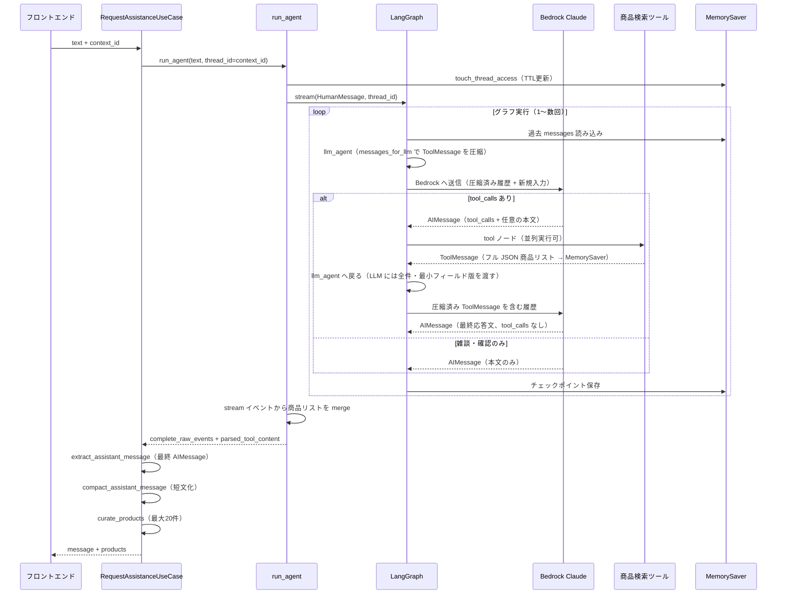
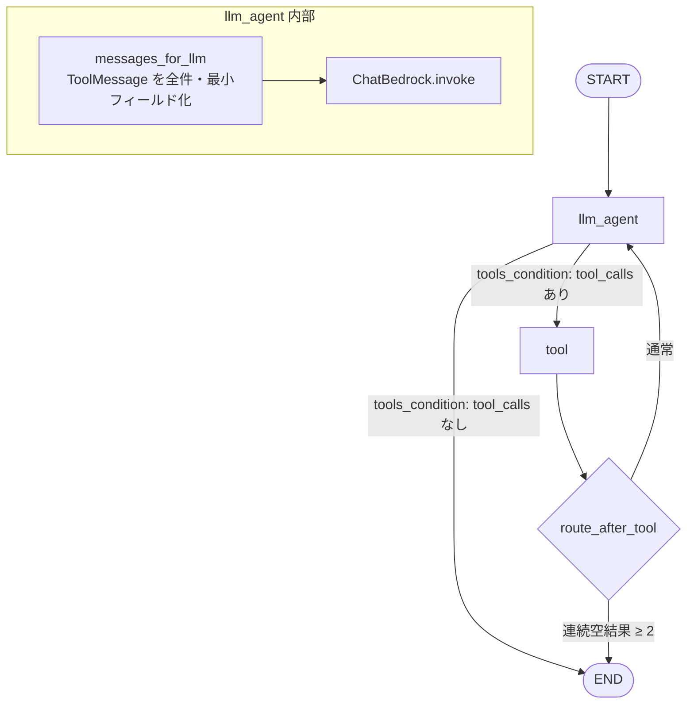
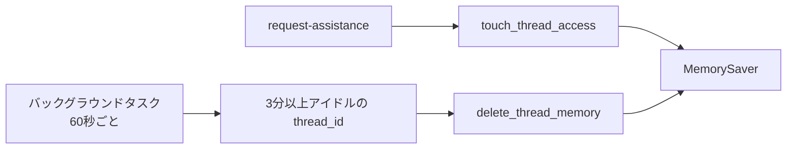

# LangGraph エージェント

## 概要

Shoppie の中核は `fastapi/backend/infrastructure/gateways/langgraph/langgraph_agent.py` にある **LangGraph ステートマシン**です。

ユーザーの発言を受け取り、AWS Bedrock 上の Claude Haiku 4.5 がツール（商品検索）を選び実行し、自然な日本語で応答を返します。

実装ファイル:

| ファイル | 役割 |
|---------|------|
| `langgraph_agent.py` | グラフ定義・実行・メモリ管理 |
| `*_tool_wrappers.py` | LangChain `@tool` 定義（Yahoo / 楽天 / Amazon） |
| `infrastructure/agent_response.py` | LLM 応答文の抽出・短文化 |
| `infrastructure/tool_result_summary.py` | LLM 向けツール結果の全件・最小フィールド化 |
| `usecase/request_assistance.py` | エージェント呼び出し〜 API レスポンス整形 |
| `infrastructure/product_curation.py` | 表示用商品の厳選（最大 20 件） |

---

## エンドツーエンドの処理フロー

1回の `POST /request-assistance` が通るときの全体像です。



**ポイント:** MemorySaver には **ツールのフル JSON** が残り、LLM には **同じ全件数だが各商品フィールドを最小化した JSON** が渡されます。画面の商品カードは `parsed_tool_content`（フルデータ）経由 — 後述の「二つの出力経路」を参照。

---

## グラフ構造



### ノード一覧

| ノード | 関数 / クラス | 入力 | 出力 |
|--------|--------------|------|------|
| `llm_agent` | `llm_node` | `State.messages`（履歴全体） | 新しい `AIMessage` を `messages` に追加 |
| `tool` | `ToolNode(SHOPPING_TOOLS)` | 直前 `AIMessage` の `tool_calls` | 各ツールの `ToolMessage`（**フル JSON**）を `messages` に追加 |

`llm_agent` は Bedrock を呼ぶ直前に `messages_for_llm()` で `ToolMessage` を変換します。チェックポイント上のメッセージは書き換えません。

### ステート定義

```python
class State(TypedDict):
    messages: Annotated[list[AnyMessage], add_messages]
```

`add_messages` により、各ノードが返したメッセージは **追記マージ** されます（上書きではない）。

### 分岐条件

#### `llm_agent` の後 — `tools_condition`（LangGraph 組み込み）

| 直近 AIMessage | 次のノード |
|---------------|-----------|
| `tool_calls` がある | `tool` |
| `tool_calls` がない | `END` |

#### `tool` の後 — `route_after_tool`（カスタム）

末尾から遡り、連続する「空のツール結果」の数を数えます。

**空とみなす `ToolMessage`:**

- 商品リスト `[]`
- `{"error": "..."}`
- `{"message": "商品が見つかりませんでした。"}` など

| 条件 | 次のノード |
|------|-----------|
| 連続空結果 **2 件以上** | `END`（LLM に戻らず打ち切り） |
| それ以外 | `llm_agent`（ツール結果を踏まえて再推論） |

---

## 1 ターンのメッセージの流れ（商品検索の典型例）

ユーザーが「黒いスニーカー探して」と言った場合の、**MemorySaver に蓄積される messages** のイメージです。

```
[0] HumanMessage      "黒いスニーカー探して"          ← 今回の入力
[1] AIMessage         tool_calls=[yahoo, rakuten, amazon]  content="探してみるね！"
[2] ToolMessage       name=yahoo   content=[{title, price, url, image, description, ...}, ...]  ← フルデータ（MemorySaver）
[3] ToolMessage       name=rakuten content=[{...}, ...]
[4] ToolMessage       name=amazon  content=[{...}]
[5] AIMessage         content="いいの見つけたよ！..."   tool_calls=[]  ← 最終応答
```

### llm_agent がツール結果をどう処理するか

2回目以降の `llm_node` では、Bedrock へ送る直前に `messages_for_llm()` が **全商品を残しつつ各件のフィールドだけ削ります**。

| 保存先 | ToolMessage の中身 |
|--------|-------------------|
| MemorySaver（チェックポイント） | ツール API のフル JSON（url, image, description 等すべて） |
| Bedrock への入力（その場だけ） | 全件数そのまま、`title` / `price` / `marketplace` / `amazon_search_link` のみ |

LLM に渡る圧縮例（Yahoo 15 件の場合）:

```json
{
  "marketplace": "Yahoo",
  "count": 15,
  "products": [
    {"title": "黒スニーカー A", "price": "5980", "marketplace": "Yahoo"},
    {"title": "黒スニーカー B", "price": "7200", "marketplace": "Yahoo"}
  ],
  "note": "詳細URL・画像はユーザーの画面カードに表示済み"
}
```

件数は **ツールが返した全件**（例: Yahoo 最大 50、楽天 10、Amazon 30）。3 件サンプルなどには切りません。

```python
def llm_node(state: State):
    prompt = ChatPromptTemplate.from_messages([
        MessagesPlaceholder(variable_name="messages"),
    ])
    agent = prompt | llm.bind_tools(SHOPPING_TOOLS)
    llm_input = {"messages": messages_for_llm(state.get("messages", []))}
    result = agent.invoke(llm_input)
    return {"messages": result}
```

つまり LLM は:

1. ユーザーの発言
2. 自分が以前出した `tool_calls`（どのツールを呼んだか）
3. 各 `ToolMessage` の **全件・最小フィールド JSON**

を文脈として読んだうえで、最終的な日本語応答を生成します。

システムプロンプト（`SHOPPING_SYSTEM_PROMPT`）は `model_kwargs.system` として常時付与され、口調・検索ルール・「商品は画面カードで見せるので本文は短く」などの制約を与えます。

### ツール呼び出し（tool ノード）

`ToolNode` が `AIMessage.tool_calls` を解釈し、対応する Python 関数を実行します。

```python
@tool(args_schema=YahooSearchProductInput)
def search_yahoo_products_with_filters_tool(keyword: str, filters: ...) -> dict:
    result_json = yahoo_api.search_products_with_filters(keyword, filters_dict)
    return json.loads(result_json)  # list[dict] または {"error": ...}
```

| 戻り値の形 | 意味 | MemorySaver | LLM への入力 |
|-----------|------|-------------|-------------|
| `[{title, url, price, image, ...}, ...]` | 検索成功 | フル JSON を保存 | 全件・`title`/`price` 等のみ |
| `{"error": "..."}` | API 失敗 | そのまま保存 | `error` + `marketplace` のみ |
| `{"message": "商品が見つかりませんでした。"}` | 0 件 | そのまま保存 | `count: 0` + `message` |

Claude は 1 回の `AIMessage` で **複数 `tool_calls` を並列発行** できます（Yahoo + 楽天 + Amazon を同時に呼ぶ）。

---

## run_agent の役割（グラフ外の処理）

`graph_app.stream()` はイベントを逐次返します。`run_agent` はこのストリームを監視し、**API レスポンス用のデータ** を組み立てます。

```python
for event in graph_app.stream(
    {"messages": [HumanMessage(content=user_input)]},
    {"configurable": {"thread_id": thread_id}},
):
    # event 例: {"llm_agent": {"messages": [...]}}
    # event 例: {"tool": {"messages": [ToolMessage, ...]}}
```

### イベントごとの処理

| イベント | run_agent の動き |
|---------|-----------------|
| `llm_agent` | ログ出力（`tool_calls` 数、本文プレビュー） |
| `tool` | 各 `ToolMessage.content` を JSON パースし、商品リストを `merge_tool_content` |

### 商品リストのマージ（LLM 履歴とは別）

```python
parsed_tool_content = None

# tool イベントのたびに:
if isinstance(content, dict) and content.get("error"):
    continue  # エラーは商品リストに含めない

parsed_tool_content = merge_tool_content(parsed_tool_content, content)
# list + list → 連結（Yahoo 20 + 楽天 10 + ...）
```

この `parsed_tool_content` が `RequestAssistanceUseCase` に渡り、`product_curation.py` で最大 20 件に厳選されたあとフロントに返ります。

**3 つのデータ経路:**

| 経路 | 内容 | 用途 |
|------|------|------|
| MemorySaver `ToolMessage` | フル JSON | 会話履歴・再検索の文脈 |
| Bedrock 入力（`messages_for_llm`） | 全件・最小フィールド | 応答文生成 |
| `parsed_tool_content` | フル JSON マージ | 画面の商品カード |

---

## 応答文の抽出と短文化

### 抽出 — `extract_assistant_message`

`complete_raw_events` を **後ろから** 走査し、最後の `llm_agent` イベント内 `AIMessage.content` を採用します。

```python
for event in reversed(response.get("complete_raw_events", [])):
    if "llm_agent" not in event:
        continue
    last = messages[-1]
    if last.content:
        return last.content
```

ツール呼び出し直後の AIMessage（`content` が空または短い前置きのみ）ではなく、**グラフ終了直前の最終 AIMessage** が選ばれます。

### 短文化 — `compact_assistant_message`

商品がある場合、LLM の長文を抑えます。

| 条件 | 処理 |
|------|------|
| 価格・番号リストっぽい長文 | 固定文「いいの見つけたよ！下のカードで見てみてね♪」に置換 |
| それ以外 | 最大 2 文 / 150 字にクリップ |

商品の詳細はフロントのカードに任せる設計です。

---

## 登録ツール

| ツール名 | モール | 実装 | API 返却上限 |
|---------|--------|------|-------------|
| `search_yahoo_products_with_filters_tool` | Yahoo!ショッピング | `yahoo_tool_wrappers.py` | 50 件 |
| `search_rakuten_products_with_filters_tool` | 楽天市場 | `rakuten_tool_wrappers.py` | 10 件 |
| `search_amazon_products_with_filters_tool` | Amazon.co.jp | `amazon_tool_wrappers.py` | 30 件（または検索リンク 1 件） |

環境変数が未設定のモールは、プロンプト上で利用不可として扱われます（`marketplace_config.py`）。

### 検索ポリシー（システムプロンプト）

| ユーザーの言い方 | エージェントの動き |
|----------------|------------------|
| 「黒いシューズ探して」（モール指定なし） | **利用可能な全モール**のツールを並列実行 |
| 「楽天で探して」 | 楽天ツールのみ |
| 「Amazonで」 | Amazon ツールのみ |
| 「他でも探して」「どこが安い」 | 利用可能な全モール |

- モールを聞き返すことは禁止
- 返答文は短く（1〜3 文、120 字以内）
- Amazon が検索リンク 1 件のみ返した場合も失敗扱いにしない

---

## 会話メモリ（MemorySaver）

```python
memory = MemorySaver()
graph = graph.compile(checkpointer=memory)
```

| 項目 | 内容 |
|------|------|
| 保存場所 | Render プロセスの RAM（`memory.storage`） |
| キー | `thread_id`（= フロントの `context_id`） |
| 保存内容 | `HumanMessage` / `AIMessage` / `ToolMessage` の列（**商品 JSON 含む**） |
| 永続化 | なし（DB / Redis 不使用） |
| Gunicorn | ワーカー数 **1** 必須（`Dockerfile`） |

### 定期削除（アイドル TTL）

メモリ肥大化を防ぐため、**最終アクセスから 3 分間** 操作がない `thread_id` を自動削除します。

| 定数 | 値 | 意味 |
|------|-----|------|
| `THREAD_IDLE_TTL_SECONDS` | 180 | この秒数触られなければ削除対象 |
| `THREAD_CLEANUP_INTERVAL_SECONDS` | 60 | 掃除バッチの実行間隔 |



- FastAPI 起動時に `start_thread_memory_cleanup()` でバックグラウンドタスク開始（`infrastructure/router/fastapi.py` の lifespan）
- 「新しい会話」(`DELETE /context/{id}`) でも即削除
- サーバー再起動ですべて消える

詳細は [セッション・デプロイ・開発](./operations.md#会話文脈セッション) も参照。

---

## LLM 設定

| 項目 | 値 |
|------|-----|
| モデル | `anthropic.claude-haiku-4-5-20251001-v1:0` |
| プロバイダ | `langchain_aws.ChatBedrock` |
| temperature | 0.7 |
| max_tokens | 256 |
| 環境変数 | `BEDROCK_AWS_ACCESS_KEY_ID`, `BEDROCK_AWS_SECRET_ACCESS_KEY`, `BEDROCK_AWS_REGION` |
| リトライ | Bedrock スロットリング時、最大 5 回指数バックオフ |

レガシーモデル ID が環境変数に残っている場合は Haiku 4.5 にフォールバックします（`resolve_bedrock_model_id`）。

---

## Shoppie キャラクター口調

システムプロンプトで指定:

- 一人称: 「わたし」または「Shoppie」
- 語尾: 「〜だよ」「〜ね」「〜かな？」
- 堅い敬語・店員口調は避ける
- 絵文字は最大 1 つ

---

## ログの読み方

Render ログで 1 リクエストを追うときの例:

```
agent start thread_id=... history_messages=8 input='...'
graph event thread_id=... node=llm_agent
llm response thread_id=... tool_calls=3 content='...'
graph event thread_id=... node=tool
tool result thread_id=... products=20 total=20
tool result thread_id=... products=10 total=30
tool result thread_id=... products=1 total=31
graph event thread_id=... node=llm_agent
llm response thread_id=... tool_calls=0 content='いいの見つけたよ！...'
agent done thread_id=... duration_ms=... events=3 products=31
product curation input=31 output=20 by_marketplace={...}
request-assistance done thread_id=... products=20
```

| ログ | 意味 |
|------|------|
| `history_messages=N` | MemorySaver に N 件のメッセージが既にある |
| `tool_calls=3` | LLM が 3 つのツールを同時に呼んだ |
| `products=31` | マージ後の生商品数（厳選前） |
| `product curation output=20` | 画面に返す件数 |
