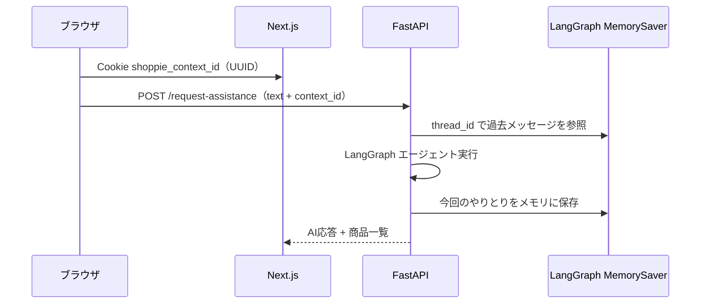

# セッション・デプロイ・開発

## 会話文脈（セッション）

会話の文脈は **永続化しません**。同一セッション中だけ、2 層で保持します。



### 1. セッション ID（フロントエンド）

- Cookie 名: `shoppie_context_id`
- 値: UUID v4
- 有効期限: 7 日
- API 送信時のキー名: `context_id`
- バックエンドでのキー名: `thread_id`

### 2. LangGraph MemorySaver（エージェント）

- インメモリチェックポイント（`MemorySaver`）
- `thread_id` ごとに LLM 入力履歴を保持（`HumanMessage` / `AIMessage` / `ToolMessage`）
- サーバー再起動で消える
- Gunicorn ワーカー数 **1** 必須

### 3. アイドルスレッドの定期削除

メモリ肥大化を防ぐため、バックグラウンドで古いスレッドを掃除します。

| 項目 | 値 |
|------|-----|
| アイドル判定 | 最終アクセスから **3 分**（180 秒） |
| 掃除間隔 | **60 秒**ごと |
| 実装 | `langgraph_agent.py` の `cleanup_idle_thread_memories` |
| 起動 | FastAPI lifespan で `start_thread_memory_cleanup()` |

- 検索のたびに `touch_thread_access(thread_id)` でタイマーがリセットされる
- 会話を続けている間は削除されない
- 「新しい会話」は従来どおり即削除

詳細は [LangGraph エージェント — 会話メモリ](./langgraph-agent.md#会話メモリmemorysaver) を参照。

### 会話リセット

「新しい会話」ボタンで:

1. `DELETE /context/{context_id}` — MemorySaver から削除
2. Cookie を新しい UUID に更新
3. フロントの会話状態をクリア

## 本番デプロイ

### フロントエンド（Vercel）

| 項目 | 値 |
|------|-----|
| Root Directory | `nextjs/frontend` |
| Framework | Next.js |
| 環境変数 | `NEXT_PUBLIC_API_URL=https://api.shoppie-agent.com` |
| ドメイン | `shoppie-agent.com`（Cloudflare 経由） |

### バックエンド（Render）

| 項目 | 値 |
|------|-----|
| 種別 | Web Service（Docker） |
| Dockerfile | `fastapi/backend/Dockerfile` |
| ポート | 8000 |
| ドメイン | `api.shoppie-agent.com` |

Docker 起動コマンド（Dockerfile 内）:

```
gunicorn -w 1 -k uvicorn.workers.UvicornWorker main:app --bind 0.0.0.0:8000
```

### Cloudflare

- `shoppie-agent.com` → Vercel
- `api.shoppie-agent.com` → Render
- DNS / SSL / CDN

## 環境変数

テンプレート: `fastapi/.env.sample`

### AWS Bedrock

```
BEDROCK_AWS_ACCESS_KEY_ID=
BEDROCK_AWS_SECRET_ACCESS_KEY=
BEDROCK_AWS_REGION=us-east-1
BEDROCK_MODEL_ID=anthropic.claude-haiku-4-5-20251001-v1:0
```

### Yahoo

```
YAHOO_APP_ID=
YAHOO_AFFILIATE_ID=
VC_SID=
VC_PID=
```

### 楽天

```
RAKUTEN_APP_ID=
RAKUTEN_ACCESS_KEY=
RAKUTEN_AFFILIATE_ID=
RAKUTEN_HTTP_REFERER=https://shoppie-agent.com/
```

### Amazon

```
AMAZON_CREATORS_CREDENTIAL_ID=
AMAZON_CREATORS_CREDENTIAL_SECRET=
AMAZON_CREATORS_VERSION=3.3
AMAZON_PARTNER_TAG=
AMAZON_MARKETPLACE=www.amazon.co.jp
AMAZON_ACCESS_KEY=        # PA-API（任意）
AMAZON_SECRET_KEY=
AMAZON_REGION=us-west-2
```

## ローカル開発

### バックエンド

```bash
cd fastapi
cp .env.sample .env   # 値を入力
docker compose up     # または backend ディレクトリで直接起動
```

```bash
cd fastapi/backend
pip install -r requirements.txt
PYTHONPATH=. uvicorn main:app --reload --port 8000
```

### フロントエンド

```bash
cd nextjs/frontend
cp .env.sample .env.local
# NEXT_PUBLIC_API_URL=http://localhost:8000
npm install
npm run dev
```

### OpenAPI 型の更新

バックエンドのスキーマを変更したら:

```bash
cd fastapi/backend
PYTHONPATH=. python scripts/export_openapi.py

cd nextjs/frontend
npm run gen
```

## CORS

`infrastructure/router/fastapi.py` で許可オリジン:

- `https://shoppie-agent.com`
- `http://localhost:3000`
