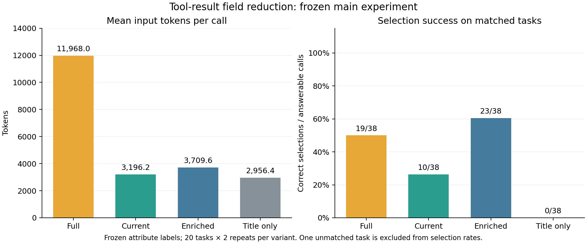

# 検索ツールの商品フィールドを減らすと、入力トークンと条件付きの商品選択はどう変わるか

- 日付: 2026-10-06
- 記録: [T-0003](../trials/0003-llm-context.md) 回6・7・8
- 実行: Codex(AI)。推薦を生成したモデルは AWS Bedrock の Claude Haiku 4.5
- HTML版: [ブラウザで読む](20261006_tool-payload.html)

## 結論

同じ100商品の検索結果で20発話を各2回評価した。実験時の最小フィールド(`current`)は、全フィールドに比べて入力トークンを73.3%減らし、価格だけの最安選択は9/10回成功した。ただし、レビュー・送料を使う発話では必要な情報がなく、全体の最安選択は10/38回だった。

レビュー・送料・商品状態を追加すると、入力トークンを69.0%減らしながら最安選択は23/38回になった。全フィールドは19/38回であり、フィールドを増やした場合にも条件の読み違いと最安価格の見落としが残った。この標本だけで、本番で使うフィールドの最適な組み合わせは決められない。

回8では、測定した4構成のうち最安選択が最も多かった追加フィールド(`enriched`)を暫定標準として実装に反映した。以下の回6・7の測定値は、変更前のコードと評価用プロンプトによる結果である。適用後の本番会話を新たに測定した値ではない。

## なぜ測ったか

検索ツールは商品名・価格に加えて、説明文、URL、画像、レビュー、送料などを返す。これを全部 LLM に渡すと入力が大きくなる。一方、情報を削ると、ユーザーがレビューや送料を指定したときに判断材料がなくなる。

既存の実装は、商品件数を減らさず、タイトルを80文字までにし、価格を数値化してモール名とともに渡していた。フィールドを削ることで入力を減らせることと、条件付きの選択に必要な情報がどこで失われるかを確かめた。

## 条件

| 項目 | 値 |
|---|---|
| 製品コードのコミット | `24e0f16be712eb88c06e0a1b6f9a53a6f20b220f` |
| 実験コード | [experiment_tool_payload.py](../../fastapi/backend/scripts/experiment_tool_payload.py)。SHA-256 は [protocol.json](data/20261006_tool-payload/protocol.json) に保存 |
| モデル | `us.anthropic.claude-haiku-4-5-20251001-v1:0`、リージョン `us-east-1` |
| 生成設定 | `max_tokens=256`、`temperature=0.7`。プロンプトキャッシュなし |
| 検索 | Yahoo!ショッピングの既存検索処理で、5キーワードを各1回、各20件取得 |
| キーワード | ウール セーター、ワイヤレスイヤホン、電気ケトル、オフィスチェア、炊飯器 |
| 発話 | 作成した20種類。各キーワードについて価格・レビュー・送料・属性の4種類。予算は前3種が1万円、後2種が2万円 |
| 主実験 | 20発話 × 4条件 × 2反復 = 160呼び出し。各条件40回 |
| 実行順 | 全160回を seed `20261006` でシャッフル |
| 計測範囲 | 取得済みの検索結果を受け取った後の LLM 呼び出し1回。検索前のツール選択や、会話履歴全体は含まない |
| 出力 | 評価用の `record_recommendation` ツールを強制し、選択状態・商品ID・理由を記録 |

検索結果は一度取得して固定し、4条件で商品件数と順序をそろえた。「全フィールド」はモール API の原文ではなく、既存ツールが整形した商品データである。アフィリエイト設定は検索時に使わず、保存前にURLと画像URLのクエリを除いた。この処理によって、通常のアフィリエイトURLを含むツール出力とはトークン数が異なる。

| 条件 | LLM に渡した商品フィールド |
|---|---|
| 全フィールド (`full`) | `title`、`price`、`marketplace`、`url`、`image`、`description`、`review_rate`、`review_count`、`shipping`、`condition` |
| 実験時の最小フィールド (`current`) | 測定当時の `summarize_tool_payload` が作る `title`(80文字まで)、`price_yen`、`marketplace` |
| 追加フィールド (`enriched`) | 実験時の最小フィールドに `review_rate`、`review_count`、`shipping`、`condition` を追加 |
| 商品名だけ (`title_only`) | 実験時の最小フィールドから価格と商品ごとのモール名を削除 |

各条件に採点用の `product_id` を加え、共通の外枠・指示・ツール定義を付けた。ストア名は既存ツールの出力にないため、追加対象に含めなかった。全フィールドと最小フィールドの違いには、タイトル短縮と価格の数値化も含まれる。

### 採点

検索結果と採点基準をモデル呼び出し前に固定した。価格・レビュー・送料は構造化フィールドで判定し、商品属性は Codex が `title` と `description` の肯定的な記載を事前に注釈した。商品仕様の実在性を確認した人手評価ではない。

| 発話の種類 | 必須条件と正解 |
|---|---|
| 価格 | 予算以内で、商品価格が最も安い候補 |
| レビュー | 予算以内、評価4.0以上、レビュー10件以上で、商品価格が最も安い候補 |
| 送料 | 予算以内、`shipping` が `送料無料` と一致し、商品価格が最も安い候補。条件付き送料無料は除外 |
| 属性 | 予算以内で、洗える・ANC・温度調節・リクライニング・IH方式のいずれかが記載された候補のうち最安 |

最安価格が同じ候補はすべて正解にした。20発話のうち19種類に正解候補があり、2反復で38回を最安選択の分母とした。ウール セーターの送料条件には予算内の正解候補がなく、この2回は別に扱った。

- **最安選択の成功**: 返した商品IDが、固定した正解候補に含まれること。
- **棄権**: `insufficient` または `no_match`。情報がない場合に棄権したことを、最安選択の成功には数えない。
- **条件違反・入力に根拠のない選択**: 必須条件に合わない商品、または渡したデータでは条件を確認できない商品を選んだ回数。最安を見落としただけの選択は含めない。理由文全体の事実性は採点していない。

全データでも確認できる候補がない場合は、棄権を適切な判定として別の `correct_decision` に集計した。ここでは `no_match` と `insufficient` の区別は採点していない。

## 結果

### 回6: 厳密なJSON出力で採点を試みた

最初の8呼び出しは、JSONを返すよう指示して評価した。モデルが説明文やMarkdownを付け、厳密なJSONとして抽出できた回答は0/8回だった。うち2回は256トークンで途中終了した。この8回は主実験の選択成功率に混ぜていない。

その後、出力用ツールのスキーマに結果を入れる形式に変更した。入力商品・発話・属性注釈・正解候補は変えず、主実験の160回を実行した。

### 回7: 構造化出力で4条件を比較した

| 条件 | 平均入力トークン | 全フィールドからの削減 | 最安選択の成功 | 棄権 / 40回 | 条件違反・入力に根拠のない選択 / 40回 |
|---|---:|---:|---:|---:|---:|
| 全フィールド | 11,968.0 | — | 19/38 (50.0%) | 0 | 4 |
| 実験時の最小フィールド | 3,196.2 | 73.3% | 10/38 (26.3%) | 23 | 0 |
| 追加フィールド | 3,709.6 | 69.0% | 23/38 (60.5%) | 3 | 1 |
| 商品名だけ | 2,956.4 | 75.3% | 0/38 (0.0%) | 40 | 0 |



| 条件 | 価格 / 10回 | レビュー / 10回 | 送料 / 8回 | 属性 / 10回 |
|---|---:|---:|---:|---:|
| 全フィールド | 8 | 3 | 6 | 2 |
| 実験時の最小フィールド | 9 | 0 | 0 | 1 |
| 追加フィールド | 8 | 5 | 6 | 4 |
| 商品名だけ | 0 | 0 | 0 | 0 |

表は必須条件を満たしただけでなく、条件内で最安の商品を選べた回数である。最小フィールドではレビュー10回・送料10回のすべてで棄権した。追加フィールドは最小フィールドより平均513.4トークン多く、レビューと送料の条件を確認できるようになったが、最安候補の見落としは残った。

最安条件を外し、予算とレビュー・送料・属性の必須条件だけをフルデータで照合すると、条件に合う商品を選んだ回数は全フィールド36/38、最小フィールド17/38、追加フィールド36/38、商品名だけ0/38だった。条件に合う商品を選びながら最安を見落とした回数は、それぞれ17回・7回・13回・0回だった。

| 条件 | 平均出力トークン | クライアント計測の中央値 (ms) | Bedrock計測の中央値 (ms) | 40回の費用概算 (USD) |
|---|---:|---:|---:|---:|
| 全フィールド | 115.65 | 1,733.4 | 1,531.5 | 0.552035 |
| 実験時の最小フィールド | 109.28 | 1,458.2 | 1,253.0 | 0.164673 |
| 追加フィールド | 111.13 | 1,531.4 | 1,313.5 | 0.187670 |
| 商品名だけ | 106.80 | 1,409.7 | 1,194.0 | 0.153578 |

入力・出力トークンは Bedrock の `usage.inputTokens` / `outputTokens` の実測値を使った。APIエラー・再試行・主実験での出力打ち切りは各0回で、160回すべての商品選択構造を読み取れた。[AWS Converse API](https://docs.aws.amazon.com/bedrock/latest/APIReference/API_runtime_Converse.html)

理由を60文字以内にする指示を超えた回答は24/160回あった。選択構造の有効性とは分けて [analysis.json](data/20261006_tool-payload/analysis.json) に集計し、選択成功率の採点には使っていない。

費用は Geo Standard の公開単価、入力100万トークンあたり1.10 USD、出力100万トークンあたり5.50 USDから計算した。`(入力 × 1.10 + 出力 × 5.50) / 1,000,000`。主実験は1.057956 USD、初回8回は0.054557 USD、接続確認1回(入力26・出力4)は0.000051 USDで、合計約1.112563 USD。請求額は照合していない。[Anthropic公式価格表、2026-05-27発効、6ページ](https://www-cdn.anthropic.com/files/4zrzovbb/website/3684c2faafb97418665782cea0001f439f74b1d2.pdf#page=6)

## 分かったこと・言えないこと

- 件数を減らさず、フィールドを絞ることで入力を減らせた。実験時の最小フィールドは、この標本では価格だけの比較に9/10回対応した。
- レビュー・送料を削ると、対応する条件を確認できなくなった。棄権によって根拠のない選択は防げたが、商品の選択には至らなかった。
- 情報の欠落と、選択処理の誤りは別に起きた。例えばオフィスチェアでは、最安の4,380円を見落として4,799円を選んだ回答が、全フィールド・最小フィールド・追加フィールドのそれぞれにあった。
- 100商品のうち34件が80文字を超えた。属性の支持語がある30件中、説明文にだけあるものが5件、タイトル短縮で支持語が消えるものが1件あった。イヤホン `q2-02` の `ANC` は元タイトルの95文字目から始まり、最小フィールドでは失われた。
- 説明文の欠損は5/100件。レビューや送料の値があることは、データの正確さやレビューの信頼性を保証しない。
- 属性注釈には、説明文の関連キーワードだけで支持した4商品が含まれる。その4件を除いた場合に正解候補が変わるのは、オフィスチェアの属性条件1/20種類だった。最安選択は追加フィールドが24/38回となり、ほかの条件は同じだった。これは事後の感度分析として [sensitivity.json](data/20261006_tool-payload/sensitivity.json) に分けて残した。
- 5検索・20種類の作成した発話を各2回測った。発話が40種類ある実験ではない。Yahoo!ショッピング以外のモール、件数の削減、長い会話履歴、検索前のルーティングは評価していない。
- 評価用の指示と構造化出力を使った、商品選択能力の代理評価である。本番の短い会話文の自然さや利用者の満足度は測っていない。生成のばらつきがあり、条件ごとの有意差や本番の速度改善は主張できない。

## だから次

回7の結果から、レビュー・送料の判断材料を残す方針を選び、回8で追加フィールドを標準にした。商品名だけへの削減は採用しない。属性比較については、関連する説明文とタイトルの支持語を残す方法を比較する。

同時に、価格・レビューの条件判定と最安選択を数値処理で行う方法を検証する。今回の主実験では情報量を変えても最安の見落としがあり、フィールドの調整だけでは安定した商品選択に至らなかった。回6・7では製品のプロンプトと圧縮処理を変更せず、回8で次の構成に変更した。

## 回8: 測定済みの構成を標準にした

2026-10-06に、測定済みの `enriched` を通常のLLM入力に採用した。商品ごとの共有範囲は次のとおりである。

| フィールド | 共有方法 |
|---|---|
| `title` | 元タイトルを80文字までに短縮。従来と同じ処理 |
| `price_yen` | 既知の正の価格を数値化。数値化できない価格表現は従来どおり `price` に残す場合がある |
| `marketplace` | 商品またはツールのモール名 |
| `review_rate`・`review_count`・`shipping`・`condition` | 元データにキーがある場合だけ、その値をコピー。`null`・空文字・0も保持 |
| `amazon_search_link` | Amazonの検索リンク用マーカーを保持 |

直近のツール実行分の全商品を、元の順序で共有する。URL・画像・説明文は画面の商品カードに渡す。レビュー・送料・商品状態のキーがないモールの出力には、これらの値を補わない。

プロンプトも、レビュー評価とレビュー件数の双方を確認すること、条件付き送料無料を通常の送料無料と区別すること、共有データで確認できない属性を推定しないことを明示した。Amazonの `amazon_search_link` は検索への案内として扱い、実商品の0円として価格比較しない。

凍結した5検索・100商品について、新しい共有処理の出力が当時の `enriched` と完全一致し、元のフルデータを変更しないことを確認した。比較から採点用の `product_id` は除いた。共有処理19件、文脈ログ2件、domain・usecase11件の計32テストも通過した。検証コードは [verify_tool_payload_policy.py](../../scripts/verify_tool_payload_policy.py)、結果は [policy_verification.json](data/20261006_tool-payload/policy_verification.json) に保存した。

採用根拠は回7の入力69.0%削減・最安選択23/38回である。共有する4フィールドを固定した構成で測っており、利用者の条件ごとに切り替える構成は測っていない。今回の適用は、その測定済み構成を標準化したものになる。プロンプト変更を含む適用後の本番会話の選択成功率・レイテンシ・費用はまだ測っていない。

タイトル延長や説明文の選択的な共有は、回7では比較していない。80文字の短縮による支持語の消失と、説明文にしか属性の根拠がない商品への対応は残る。数値処理による最安選択も今後の検証対象とする。[ADR-0011](../adr/0011-three-path-data.md)

## 使ったデータ

| 種類 | 場所 |
|---|---|
| 検索条件・20発話・事前の基準 | [plan.json](data/20261006_tool-payload/plan.json) |
| 凍結した100商品のツール出力 | [snapshots.json](data/20261006_tool-payload/snapshots.json) |
| 属性の注釈と引用した根拠 | [attributes.json](data/20261006_tool-payload/attributes.json) |
| 評価前に固定した正解候補 | [expected.json](data/20261006_tool-payload/expected.json) |
| プロンプト・生成設定・入力とコードのSHA-256 | [protocol.json](data/20261006_tool-payload/protocol.json) |
| 主実験の160回答・usage・遅延 | [responses.jsonl](data/20261006_tool-payload/responses.jsonl) |
| 回ごとの採点・条件別集計 | [scores.csv](data/20261006_tool-payload/scores.csv)、[summary.json](data/20261006_tool-payload/summary.json) |
| 欠損・タイトル短縮の集計 | [dataset_stats.json](data/20261006_tool-payload/dataset_stats.json) |
| 初回の出力失敗 | [pilot_protocol.json](data/20261006_tool-payload/pilot_protocol.json)、[pilot_responses.jsonl](data/20261006_tool-payload/pilot_responses.jsonl)、[pilot_summary.json](data/20261006_tool-payload/pilot_summary.json) |
| 感度分析・補助集計・図のコード | [analyze.py](data/20261006_tool-payload/analyze.py)、[sensitivity.json](data/20261006_tool-payload/sensitivity.json)、[analysis.json](data/20261006_tool-payload/analysis.json) |
| 検索・LLM呼び出し・採点のコード | [experiment_tool_payload.py](../../fastapi/backend/scripts/experiment_tool_payload.py) |
| 回8の共有構成の一致と当時のコード・入力量の監査 | [verify_tool_payload_policy.py](../../scripts/verify_tool_payload_policy.py)、[policy_verification.json](data/20261006_tool-payload/policy_verification.json) |

実際の利用者の発話・Cookie・APIキー・アフィリエイトIDは入れていない。各入力・計測ファイルは2 MiB以内である。回7終了時に、変更前の圧縮処理のテストは7件通過した。

実験コードは製品の `summarize_tool_payload` を参照する。回8でこの処理を変更したため、当時の4構成の入力再生成とコードハッシュの監査には、レポート公開時のコミット `629c2cc2dc1ad4fba5aa88ed63c84a6bec9656be` を使う。凍結したデータ・回答・プロトコルと実験コードは変更していない。

独立したcheckoutのルートから、保存した回答をネットワークアクセスなしで再集計し、当時のコードハッシュを監査できる。

```sh
git worktree add --detach /tmp/shoppie-tool-payload-20261006 629c2cc2dc1ad4fba5aa88ed63c84a6bec9656be
cd /tmp/shoppie-tool-payload-20261006
python3 fastapi/backend/scripts/experiment_tool_payload.py summarize --data-dir docs/reports/data/20261006_tool-payload
python3 docs/reports/data/20261006_tool-payload/analyze.py
```

同じ入力で推論を再実行する場合も、このコミットのcheckoutで行う。空の別ディレクトリに `plan.json`・`snapshots.json`・`attributes.json` をコピーし、`prepare`、`run --env-file .env`、`summarize` の順に実行する。`run` には実行環境で用意した認証設定を渡す。`run` は保存済みの成功した呼び出しをスキップする。検索データを取り直す場合は、`capture` の後に属性を再注釈し、正解候補を固定してからモデルを実行する。

回8の適用確認は、適用後のcheckoutのルートからネットワークアクセスなしで実行する。検証スクリプトは `629c2cc2dc1ad4fba5aa88ed63c84a6bec9656be` のコードをgitから読み出し、実験コードと圧縮処理のSHA-256、保存した160回の入力文字数・バイト数との一致、新しい共有処理と当時の `enriched` の一致を確認する。

```sh
python3 scripts/verify_tool_payload_policy.py
```

適用後の32テストは、バックエンドのディレクトリで次のように実行した。モールAPIやモデルを呼ぶ通信テストは含めていない。

```sh
cd fastapi/backend
PYTHONPATH=. python3 -m pytest -q \
  domain/test_domain_objects.py usecase/test_usecases.py \
  infrastructure/gateways/langgraph/test_tool_result_summary.py \
  infrastructure/gateways/langgraph/test_llm_context_log.py
```
