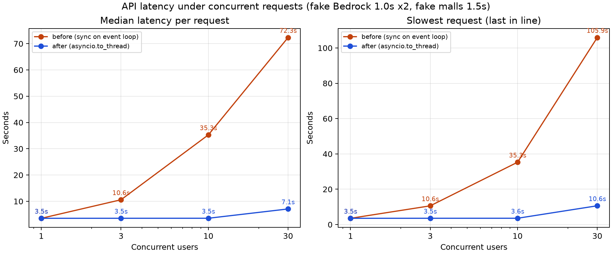

# グラフの実行を別スレッドに移すと、同時に話しかけられたときの待ち時間は変わるか

- 日付: 2026-10-08
- 記録: [T-0017](../trials/0017-KEY-traffic-capacity.md) 回2
- 実行: Claude
- HTML版: [同名のHTML](20261008_agent-concurrency.html)

## 結論
変わる。変更前は同時に来たリクエストが 1 件ずつ処理され、10 人同時で全員が約 35.3 秒待った。変更後は 10 人同時でも全員が 1 人のときと同じ約 3.55 秒で返った。
30 人同時では変更後も最大 10.6 秒になった。別スレッドの数の上限(計測環境では 12)で 3 回に分かれて処理されたためである。

## なぜ測ったか
[T-0017 回1](../trials/0017-KEY-traffic-capacity.md) でコードを読み、`async def run_agent` が同期の `graph_app.stream()` をイベントループ上で直接呼んでいることを確認した。Gunicorn は 1 ワーカーなので、同時に処理できるのは実質 1 リクエストと見込んだ。
仮説は 2 つ。変更前は最後の人の待ち時間が「人数 × 1 往復」になる。`asyncio.to_thread` に移せば、スレッドの数までは 1 往復の時間のまま返る。

## 条件
| 項目 | 値 |
|---|---|
| コミット | 変更前 `2311c5a`、変更後 `c94e1c4`。計測スクリプトは `95d1064` |
| 変更 | `run_agent` の `run_with_retry()` を `await asyncio.to_thread(run_with_retry)` に変更 |
| 外部サービス | Bedrock とモール API を、一定時間待つ偽物に差し替えた。LLM は 1 回 1.0 秒で、1 往復に 2 回(ツール選択と返答)。モールは 1 回 1.5 秒で、Yahoo・楽天・Amazon の 3 つを並列に呼ぶ |
| 1 往復の想定 | 1.0 + 1.5 + 1.0 ≒ 3.5 秒。実測した本番の値ではなく、仮に置いた値 |
| サーバー | uvicorn 1 プロセス・1 イベントループ(本番の Gunicorn `-w 1` + UvicornWorker と同じ並列度)。LangGraph のグラフ・MemorySaver・FastAPI の経路は本番と同じコード |
| 計測環境 | macOS、8 コア、Python 3.12.2、LangGraph 0.4.8。`asyncio.to_thread` のスレッドの上限は既定の min(32, コア数 + 4) = 12 |
| 負荷 | 同時 1・3・10・30 人。全員がそろってから一斉に 1 回ずつ送る。各人数で 3 回 |
| 指標 | 1 人ごとの応答時間(送信から応答の受信まで)の中央値と最大。全回をまとめて集計 |

## 結果


| 同時人数 | リクエスト数 | 変更前 中央値 | 変更前 最大 | 変更後 中央値 | 変更後 最大 | 成功 |
|---|---|---|---|---|---|---|
| 1 | 3 | 3.53 秒 | 3.53 秒 | 3.53 秒 | 3.53 秒 | 全件 |
| 3 | 9 | 10.59 秒 | 10.59 秒 | 3.54 秒 | 3.55 秒 | 全件 |
| 10 | 30 | 35.29 秒 | 35.30 秒 | 3.55 秒 | 3.56 秒 | 全件 |
| 30 | 90 | 72.35 秒 | 105.94 秒 | 7.09 秒 | 10.63 秒 | 全件 |

変更前の 1 回目の、1 人ごとの応答時間:

| 同時人数 | 応答時間(秒、短い順) |
|---|---|
| 3 | 10.587, 10.587, 10.587 |
| 10 | 3.525, 24.694, 28.226, 31.759, 35.291, 35.291, 35.291, 35.292, 35.293, 35.293 |

## 分かったこと・言えないこと
- 変更前の最後の人の待ち時間は、3 人で 10.59 秒、10 人で 35.30 秒、30 人で 105.94 秒だった。どれも「人数 × 約 3.53 秒」に一致し、リクエストが 1 件ずつ処理されていた
- 変更前は、処理が終わった人の応答も、次の人の処理が終わるまで送り出されないことがあった。3 人同時では 3 人とも 10.59 秒で返り、最初の人も 3.5 秒では返らなかった。イベントループが止まっている間は、応答の書き出しも進まないためと考えられる
- 変更後の 30 人同時は、3.5 秒・7.1 秒・10.6 秒の 3 段に分かれた。スレッドの上限 12 を超えた分が、空きを待ってから処理された
- 本番の Render で使われるスレッドの上限は、まだ確かめていない。Python 3.10 の `os.cpu_count()` はコンテナに割り当てられた CPU ではなくホストのコア数を返すことがあり、上限が計測環境と違う可能性がある
- 外部サービスは偽物で、待ち時間を一定にしている。本番の Bedrock のクォータ・スロットリング、モール API の回数制限、応答時間のばらつきは含まない。変更後は外部サービスに同時に届く呼び出しが増えるので、これらに先に当たる可能性がある
- 本番の 1 往復の実際の時間、メモリ使用量、CPU を多く使う処理(JSON の整形など)が同時に走ったときの影響は、まだ測っていない
- 各人数で 3 回だけの計測で、すべて同じマシンで行った

## だから次
`c94e1c4` を本番に入れる。そのうえで、次の 3 点を測るか決める。
- 本番でのスレッドの上限。必要なら上限を明示的に決める
- 同時に呼ぶ回数が増えたときの Bedrock のスロットリングとモール API の 429
- アプリ側のレート制限を入れるか

## 使ったデータ
| 種類 | 場所 |
|---|---|
| 入力 | 発話は全員共通で「1万円以内のイヤホン」。会話 ID はリクエストごとに新しい UUID |
| 計測結果 | [before.json](data/20261008_agent-concurrency/before.json)・[after.json](data/20261008_agent-concurrency/after.json)(1 人ごとの応答時間)、[summary.json](data/20261008_agent-concurrency/summary.json)(集計) |
| 実行したコード | [load_test_server.py](../../fastapi/backend/scripts/load_test_server.py)・[load_test_client.py](../../fastapi/backend/scripts/load_test_client.py)(`95d1064`)、[analyze.py](data/20261008_agent-concurrency/analyze.py) |

再現手順(`95d1064` をチェックアウトし、`fastapi/backend` で実行する。変更後はそのまま測る。変更前は `langgraph_agent.py` だけを `2311c5a` に戻して測る):

```sh
# 変更前を測るときだけ
git checkout 2311c5a -- infrastructure/gateways/langgraph/langgraph_agent.py
PYTHONPATH=. python scripts/load_test_server.py --port 8765 &
python scripts/load_test_client.py --url http://127.0.0.1:8765 \
  --concurrency 1 3 10 30 --rounds 3 --label before --out before.json
# 集計と図(matplotlib が要る)
python3 ../../docs/reports/data/20261008_agent-concurrency/analyze.py
```
