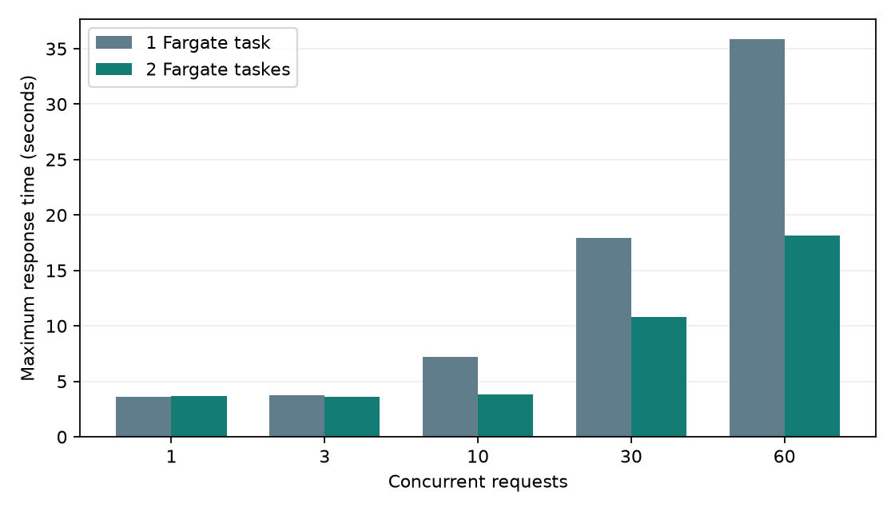

# AWS の ALB・Fargate・RDS で、1台と2台の応答時間を比較する

- 日付: 2026-10-08
- 記録: [T-0017 回4](../trials/0017-KEY-traffic-capacity.md)、[T-0002 回14](../trials/0002-KEY-conversation-state.md)、[T-0014 回7・8](../trials/0014-hosting.md)
- 関連 ADR: [ADR-0015](../adr/0015-shared-postgres-checkpoints.md)、[ADR-0016](../adr/0016-aws-api-validation.md)

## 結論

ALB 配下の2つの Fargate タスクで、同じ会話の往復数が1から2まで続いた。
負荷比較は1台312件・2台312件の計624件が全件成功した。
同時60件の最大待ち時間は1台 35.869秒、2台 18.127秒で、49.5%短くなった。
外部サービスが待ち時間の大半を占める模擬負荷では、タスク追加で処理待ちが減った。
本番の性能や Bedrock・モール API の上限はこの結果からは決められない。

## 測定条件

| 項目 | 条件 |
|---|---|
| 場所 | AWS 東京 ap-northeast-1。クライアントは AWS 外のmacOS開発端末 |
| 経路 | クライアント → ALB → ECS Fargate → 非公開 RDS |
| タスク | 1台と2台、各0.5 vCPU / 1 GiB、X86_64、Fargate platform 1.4.0 |
| API | Python 3.10.22、模擬サーバーの Uvicorn 1プロセス/タスク |
| 同時処理 | 各タスク os.cpu_count=2、asyncio executor=6スレッド（起動ログで確認） |
| DB | PostgreSQL18.3、db.t4g.micro、gp3 20GiB、Single-AZ、暗号化、公開アクセスなし |
| 会話保存 | PostgresSaver、TTL180秒、掃除60秒、会話単位 advisory lock |
| 接続プール | タスクごとにチェックポイント最大8接続・ロック最大32接続 |
| DB 認証 | ECS タスクロールから Secrets Manager の RDS 管理シークレットを取得 |
| 外部サービス | 偽物。LLM1秒×2、3モール並列各1.5秒。最低所要時間は約3.5秒 |
| 負荷 | 同時1・3・10・30・60件、各3回。一斉開始、毎回別の会話 ID |
| 順序 | 1台を全測定 → desired_count=2へ変更 → 安定後に会話共有確認・2台を全測定 |
| ウォームアップ | 各構成1件、集計から除外。共有会話確認も負荷集計から除外 |
| HTTP | TLSなし、ALB受信元は検証端末の IPv4 /32 に限定。180秒タイムアウト、リトライなし |
| ALB | 通常のターゲット振り分け、固定セッションなし。2台に厳密な同数配分は保証しない |
| 自動スケーリング | 無効。タスク数以外は同じ設定・同じイメージ digest |

ローカル試験は Python3.12・12スレッド/プロセスだった。このAWS試験は6スレッド/タスクなので、
[ローカル結果](20261008_shared-conversation-postgres.md)と待ち時間を直接同じ条件として比較できない。
模擬サーバーは本番 Dockerfile の Gunicorn 起動コマンドを置き換えている。

イメージ digest: `sha256:2199914c1a498d2714c38098cdfd90ef2ae9432ccff77924cb99a8e204de987d`。
主要ライブラリの実バージョン、ソースのSHA-256、起動ログ、ビルド時刻は
[protocol.json](data/20261008_aws-traffic-capacity/protocol.json) と
[two-task-runtime.json](data/20261008_aws-traffic-capacity/two-task-runtime.json) に保存した。
計測時のソースは基点 `67d45eb7daaec0ae6c3f9944ddd30f53f1d92fe8` からの作業ツリー変更を含む。
検証後、そのソース・レポート・生データを同じGitコミットに保存した。
計測対象はコミット `d5e6704` のソース。計測時点の各ファイルの識別には protocol.json のSHA-256を使う。
測定後にPR #22の反応イベント記録を取り込んだ最終版について、AWS負荷は再測定していない。
取り込み後は52件の単体テストと、ローカルAPIのヘルスチェック・2往復・往復ID・反応送信・文脈削除を確認した。
削除済みDBを必要とするPostgreSQL統合テスト5件は、この取り込み後の実行ではスキップした。
[取り込み後の確認](data/20261008_aws-traffic-capacity/merge-validation.json)に結果とソースハッシュを保存した。

## 結果

各同時件数について3回の全リクエストをまとめた。p95は昇順の `ceil(件数×0.95)` 番目。
時間の単位は秒。成功はHTTP200・responseあり・errorなし。

| 同時件数 | 台数 | 成功/件数 | 中央値 | p95 | 最大 |
|---|---|---|---|---|---|
| 1 | 1台 | 3/3 | 3.559 | 3.618 | 3.618 |
| 1 | 2台 | 3/3 | 3.663 | 3.665 | 3.665 |
| 3 | 1台 | 9/9 | 3.664 | 3.726 | 3.726 |
| 3 | 2台 | 9/9 | 3.598 | 3.610 | 3.610 |
| 10 | 1台 | 30/30 | 3.693 | 7.210 | 7.211 |
| 10 | 2台 | 30/30 | 3.614 | 3.728 | 3.793 |
| 30 | 1台 | 90/90 | 10.789 | 17.902 | 17.959 |
| 30 | 2台 | 90/90 | 7.180 | 10.727 | 10.791 |
| 60 | 1台 | 180/180 | 19.709 | 35.702 | 35.869 |
| 60 | 2台 | 180/180 | 10.765 | 17.997 | 18.127 |



各タスクの処理枠は6本。1台で枠を超えたリクエストは、枠が空くまで待つ。
2台では枠が増えたが、ALBの振り分け、DBと通信の待ち時間があるため、最大時間が正確に半分になるとは限らない。
送り先別の件数は [summary.json](data/20261008_aws-traffic-capacity/summary.json) の instance_requests に保存した。
バーストごとの中央値・p95・最大・処理件数/秒は生データに含む。処理件数/秒は件数÷最終応答時間で、持続負荷の処理能力ではない。

## 会話の共有

ALB に同じ context_id で順に送信し、異なる2タスクからの応答を確認した。
偽物の応答が会話の往復数を1から順に返すことを検査し、2往復で2タスクに到達した。
その後 DELETE /context で検証会話を削除した。
[session-check.json](data/20261008_aws-traffic-capacity/session-check.json) に応答・送り先・往復数を保存した。
AWSでのタスク再作成とRDSのパスワードローテーションは試していない。

## 途中の失敗と対応

### AWS CLI と操作権限

構築時に AWS CLI 2.37.10 が Homebrew Python 3.14.8 とシステム libexpat の組み合わせで起動に失敗した。
Homebrew の expat 2.9.0 をインストールし、[AWS CLI ラッパー](../../scripts/aws_cli.sh)で
CLI のプロセスだけにライブラリの場所を設定した。

ブラウザログインの `shoppie` プロファイルで初期 IAM を作成し、以後の Terraform 操作には
`shoppie-deployer` プロファイルから `ShoppieValidationDeployer` を引き受けた。
専用の `shoppie-validation-operator` ユーザーには、そのロールへの AssumeRole だけを付与した。
既存の `shoppie-agent` は利用していない。これらの専用 IAM・キー・プロファイルは実験終了後に削除した。

### イメージのビルド

開発端末の Docker ビルドが失敗し、再試行では containerd のメタデータへの書き込みが input/output error になった。
端末の空き容量は約219MiBだった。エミュレーションだけが原因とは判断できない。
既存の Docker データを削除せず、一時的な CodeBuild で linux/amd64 イメージを作成した。
ソースZIPには.env・認証情報・仮想環境を含めず、[パッケージスクリプト](../../scripts/package_aws_build.py)で同一の66ファイルを再生成できることを確認した。

## 片付け

2026-10-08T08:04:43.824931+00:00 時点で、Terraform 管理リソースの残数0と、下記のリソース・専用IAMの削除を確認した。確認結果は [cleanup.json](data/20261008_aws-traffic-capacity/cleanup.json)。
検証用の ALB、ECSサービス・タスク・クラスター、RDSとスナップショット、ECRイメージ、
VPC・サブネット・セキュリティグループ、ログ、RDS管理シークレット、
CodeBuild・ソースS3、実行・アプリ・ビルド用IAMロールの削除を確認した。
Terraform外で作った shoppie-validation-operator のキー・ユーザーと ShoppieValidationDeployer ロールも削除を確認した。
今回のRDS作成時に新規作成された AWSServiceRoleForRDS も削除し、ローカルの専用プロファイル・ロールキャッシュを削除した。
既存のECS・ELB等のサービス連携ロールは維持した。
既存の shoppie-agent IAM と Render・Vercel・Cloudflare の本番構成は変更していない。
検証中のAWS利用料は発生する。請求確定額はまだ測っていない。

## 常時稼働した場合の月額概算

2026-10-08に確認したAWS公式料金表から、この構成を1か月動かした場合を計算した。
**少量利用時の予算目安はAPI 1台で月約1.1〜1.3万円、2台で月約1.5〜1.7万円**。
以下は料金表に基づく見積もりで、今回の実験の請求額を測定したものではない。
検証リソースは削除済みで、この常時稼働費用が現在発生していることを示す数字でもない。

### 前提と単価

東京リージョン、月730時間、Linux / X86_64、各タスク0.5 vCPU・1 GiB、
RDS PostgreSQL db.t4g.micro・Single-AZ・gp3 20 GBを常時稼働させる。
自動スケーリングは無効でタスク数を固定し、ALBの公開IPv4を2個、タスクごとに1個と仮定する。
DBの管理シークレットは1個。円換算は **1 USD = 150円という試算上の仮定**で、実勢為替ではない。
税、無料枠、クレジット、Savings Plans、リザーブド料金は適用しない。

取得した単価・SKU・料金表の公開日とURLは
[料金表のスナップショット](data/20261008_aws-traffic-capacity/monthly-cost-prices.json)に保存した。

| 項目 | 単価（USD） | 1台の月額（円） | 2台の月額（円） |
|---|---|---:|---:|
| [Fargate](https://aws.amazon.com/fargate/pricing/) | vCPU時間 0.05056、GiB時間 0.00553 | 3,374 | 6,747 |
| [ALBの基本料金](https://aws.amazon.com/elasticloadbalancing/pricing/) | 時間 0.0243 | 2,661 | 2,661 |
| [RDSインスタンス](https://aws.amazon.com/rds/postgresql/pricing/) | 時間 0.025 | 2,738 | 2,738 |
| RDS gp3ストレージ | GB月 0.138 | 414 | 414 |
| [公開IPv4](https://aws.amazon.com/jp/vpc/pricing/) | アドレス時間 0.005 | 1,643 | 2,190 |
| [DB管理シークレット](https://aws.amazon.com/secrets-manager/pricing/) | シークレット月 0.40 | 60 | 60 |
| **基本部分の合計** | **1台 72.5903 USD、2台 98.7316 USD** | **10,889** | **14,810** |

円は項目ごとに四捨五入して表示し、合計は丸める前の金額から計算した。表示された各行の足し算と合計には丸めによる差がある。

### 計算式

`N`をAPIタスク数、`H = 730`を月間稼働時間、`F = 150`を円換算係数とする。
単価の通貨はUSD。

```text
Fargate      = N × H × (0.5 × 0.05056 + 1 × 0.00553)
ALB基本料金  = H × 0.0243
RDS          = H × 0.025
DBストレージ = 20 × 0.138
公開IPv4     = (2 + N) × H × 0.005
DBシークレット = 1 × 0.40

基本月額（USD） = Fargate + ALB基本料金 + RDS
                  + DBストレージ + 公開IPv4 + DBシークレット
基本月額（円）  = 基本月額（USD） × F

N = 1: 72.5903 × 150 = 10,888.545円 → 約10,889円
N = 2: 98.7316 × 150 = 14,809.740円 → 約14,810円
追加1タスク = 730 × (0.5 × 0.05056 + 0.00553 + 0.005) × 150
             = 3,921.195円 → 約3,921円/月
```

### 追加料金と予算目安

ALBの処理量は基本料金と別で、東京の単価は0.008 USD / LCU時間。
月を通した平均の課金LCUを`C`とすると、追加額は `730 × C × 0.008 × 150 = 876 × C 円/月`。
例えば平均1 LCUなら月876円が加わる。[ALB料金](https://aws.amazon.com/elasticloadbalancing/pricing/)

平均LCUを0〜1、ログ・ECR保存・シークレットAPI呼び出し等の予算枠を月100〜500円と仮置きすると、
1台は約10,989〜12,265円、2台は約14,910〜16,186円になる。
冒頭の1.1〜1.3万円／1.5〜1.7万円は、この仮定から概算した予算目安。
この実験では月間のログ量・通信量・LCUを測っていないため、利用量による上限を保証する金額ではない。

Bedrockの推論、データ転送（インターネットやAZ間）、RDSの追加CPUクレジットやストレージ増加、
追加のバックアップ・シークレット、CodeBuildのビルドとソースS3、ドメイン、Vercel、サポート契約はこの基本月額に含めない。
NAT Gatewayはこの構成にない。アクセス増加、自動スケーリング、デプロイ中のタスク増加、IPv4数の増加でも費用は変わる。
実際の支払額は利用量・稼働時間・為替・税を反映したAWSの請求で確認する。

[再計算スクリプト](data/20261008_aws-traffic-capacity/estimate_monthly_cost.py)は保存した単価を読み、
[計算結果JSON](data/20261008_aws-traffic-capacity/monthly-cost-estimate.json)を生成する。
Pythonの標準ライブラリだけで同じ計算を再現できる。

```sh
python3 docs/reports/data/20261008_aws-traffic-capacity/estimate_monthly_cost.py
```

## 限界と次の判断

- 外部APIは偽物。Bedrockのスロットリング、モールAPIの429、検索精度、実際の費用を測っていない。
- 3回の短いバーストで、継続負荷・長時間安定性・安定したp95・CPU主体の負荷は評価していない。
- 模擬サーバーのプロセス構成であり、本番Gunicorn起動で同じ性能になるとは未確認。
- RDSはSingle-AZ、管理ユーザーを利用。DBの専用権限・バックアップ復旧・フェイルオーバーを評価していない。
- シークレット更新時の新規接続は単体テストで確認したが、RDSの実ローテーションは試していない。
- TLSの証明書検証、受付制限、自動スケーリングの設定値、本番ドメイン切り替えは検証範囲外。

次は HTTPS の検証用ドメインと実APIを設定し、同時1→3→5→10件で待ち時間・エラー・クォータ・費用を測る。
その結果で受付上限とタスク数を決めてから、本番を移行する。

## 使ったデータ

- [1台の全312リクエスト](data/20261008_aws-traffic-capacity/one-task.json)
- [2台の全312リクエスト](data/20261008_aws-traffic-capacity/two-tasks.json)
- [会話共有の確認](data/20261008_aws-traffic-capacity/session-check.json)
- [集計JSON](data/20261008_aws-traffic-capacity/summary.json)・[集計と作図](data/20261008_aws-traffic-capacity/analyze.py)
- [測定条件・ソースハッシュ・実バージョン](data/20261008_aws-traffic-capacity/protocol.json)
- [2台時の起動情報](data/20261008_aws-traffic-capacity/two-task-runtime.json)
- [削除確認](data/20261008_aws-traffic-capacity/cleanup.json)
- [月額試算の単価](data/20261008_aws-traffic-capacity/monthly-cost-prices.json)・[計算結果](data/20261008_aws-traffic-capacity/monthly-cost-estimate.json)・[再計算コード](data/20261008_aws-traffic-capacity/estimate_monthly_cost.py)

入力は模擬的な「1万円以内のイヤホン」。実ユーザーの会話、Cookie ID、APIキーは含めていない。
負荷クライアントのcontext_idはランダム生成し、公開データには保存しない。

## 再現手順

1. [infra/aws/README.md](../../infra/aws/README.md)に従い、権限と検証クライアントのIPを設定して ALB・Fargate・RDS を作る。
2. 同じソースを linux/amd64 でビルドし、ECR digest URIを image_uri に設定する。mock_external_services=true、autoscaling_enabled=false、desired_count=1でapplyする。
3. ECSの安定と/healthzを確認して、以下を実行する。

```sh
python3 fastapi/backend/scripts/load_test_client.py --url http://ALB_DNS \
  --concurrency 1 3 10 30 60 --rounds 3 --label aws-one-task --out one-task.json
```

4. desired_count=2でapplyし、2ターゲットがhealthyになった後、以下を実行する。

```sh
python3 fastapi/backend/scripts/load_test_client.py --url http://ALB_DNS \
  --session-check --min-instances 2 --label aws-shared-history --out session-check.json
python3 fastapi/backend/scripts/load_test_client.py --url http://ALB_DNS \
  --concurrency 1 3 10 30 60 --rounds 3 --label aws-two-tasks --out two-tasks.json
```

5. データディレクトリに置き、analyze.pyで集計・作図する。レポートを更新し、HTMLを生成する。
6. この実験のデータは模擬入力なので、以下の設定を tfvars に追加して apply した後、destroyする。検証用IAMを削除し、スナップショット・シークレットを含む残存を確認する。

```hcl
database_deletion_protection = false
database_skip_final_snapshot = true
ecr_force_delete = true
```

```sh
terraform -chdir=infra/aws plan -out=cleanup-settings.tfplan
terraform -chdir=infra/aws apply cleanup-settings.tfplan
terraform -chdir=infra/aws plan -destroy -out=cleanup.tfplan
terraform -chdir=infra/aws apply cleanup.tfplan
terraform -chdir=infra/aws state list
```

集計・作図には matplotlib、HTML生成には scripts/requirements-report.txt の依存をインストールする。

```sh
python3 docs/reports/data/20261008_aws-traffic-capacity/analyze.py
python3 scripts/render_experiment_report.py docs/reports/20261008_aws-traffic-capacity.md
```

## 出典

測定の出典は上記の生データ、起動ログ、ソースハッシュ。
構成は [Terraform](../../infra/aws/main.tf)、[ビルダー](../../infra/aws/build.tf)、
処理は [模擬サーバー](../../fastapi/backend/scripts/load_test_server.py)、
[負荷クライアント](../../fastapi/backend/scripts/load_test_client.py)、
[会話ストア](../../fastapi/backend/infrastructure/gateways/langgraph/conversation_store.py)。

- [AWS: ECSサービスの負荷分散](https://docs.aws.amazon.com/AmazonECS/latest/developerguide/service-load-balancing.html)
- [AWS: RDSのSecrets Manager連携](https://docs.aws.amazon.com/AmazonRDS/latest/UserGuide/rds-secrets-manager.html)
- [AWS: DBインスタンスの削除](https://docs.aws.amazon.com/AmazonRDS/latest/UserGuide/USER_DeleteInstance.html)
