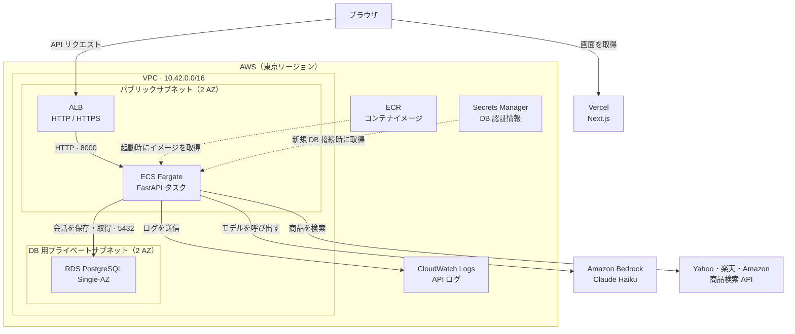
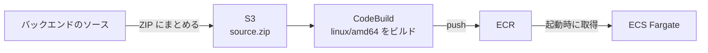

# Shoppie の AWS インフラ

FastAPI を ECS Fargate で動かし、ALB でリクエストを振り分ける。
会話のチェックポイントは RDS PostgreSQL に保存し、API タスク間で共有する。
構成は Terraform で管理する。

## 構成図



ブラウザは Vercel から画面を取得し、API リクエストを ALB へ直接送る。
ALB は `/healthz` が正常なタスクへ振り分ける。会話の状態は共通の RDS にあるため、
次のリクエストが別のタスクに届いても同じ文脈を取得できる。

## リソースと役割

| リソース | 構成・役割 |
|---|---|
| VPC | `10.42.0.0/16`。2 AZ にパブリックサブネットと DB 用プライベートサブネットを各1つ配置 |
| ALB | HTTP / HTTPS の入口。ターゲットはタスクの IP、ヘルスチェックは `/healthz` |
| ECS Fargate | タスクごとに0.5 vCPU / 1 GiB。Linux、既定の CPU アーキテクチャは X86_64 |
| RDS PostgreSQL | 既定は18.3、`db.t4g.micro`、Single-AZ。gp3 20 GiB、最大50 GiB、暗号化、バックアップ保持1日 |
| ECR | API イメージを保存。タグは変更不可、push 時にスキャン |
| Secrets Manager | RDS の管理パスワードを保持。アプリは新しい物理接続ごとに現在の接続情報を取得 |
| CloudWatch Logs | `/ecs/<name>` に API ログを保存。保持14日 |
| Application Auto Scaling | 有効時は ALB のターゲット当たりリクエスト数を基準に1〜4タスクへ調整 |
| CodeBuild / S3 | 任意のリモートビルド。ソース ZIP を S3 に置き、CodeBuild でイメージを ECR へ送信 |

ALB・Fargate・RDS・Secrets Manager・ログ・パブリック IP などに利用料が発生する。

## ネットワークと権限

ALB の受信元は `ingress_cidrs` で指定する。既定値は空で、外部からの接続は許可されない。
API は ALB のセキュリティグループからの8000番、RDS は API のセキュリティグループからの5432番だけを受け付ける。

Fargate タスクにはパブリック IP を割り当て、インターネットゲートウェイ経由で外部 API に接続する。
NAT Gateway は構成に含まれない。RDS は公開アクセスを無効にしている。

| IAM ロール | 用途 |
|---|---|
| `<name>-execution` | ECS のイメージ取得・ログ送信・`secret_env` のシークレット注入 |
| `<name>-app` | アプリによる RDS 管理シークレット取得と Bedrock のモデル呼び出し |
| `<name>-build` | CodeBuild のソース取得・ECR への送信・ビルドログ出力。有効時だけ作成 |

インフラを操作する主体の認証・権限は、これらのタスク用ロールとは別に用意する。
[bootstrap/deployer-policy.json](bootstrap/deployer-policy.json) は操作ポリシーの例で、リソース名の制約は実際の `name` に合わせる。

## ファイル

| ファイル | 内容 |
|---|---|
| [main.tf](main.tf) | ネットワーク、ALB、ECS、RDS、ECR、IAM、ログ、自動スケーリング |
| [build.tf](build.tf) | 任意の CodeBuild・ソース S3・ビルド用 IAM |
| [variables.tf](variables.tf) | 設定項目と既定値 |
| [outputs.tf](outputs.tf) | ECR URL、ALB DNS、ECS 名、DB エンドポイント |
| [versions.tf](versions.tf) | Terraform と AWS provider の指定 |
| [terraform.tfvars.example](terraform.tfvars.example) | 設定ファイルの例 |

## 主な設定

| 変数 | 用途 |
|---|---|
| `region` / `name` | 配置先リージョンとリソース名のプレフィックス |
| `image_uri` | 起動する ECR イメージ。空の場合は ECS サービス・タスク定義を作成しない |
| `ingress_cidrs` | ALB への接続を許可する IPv4 CIDR |
| `certificate_arn` | 発行済み ACM 証明書。指定すると HTTPS を追加し、HTTP を HTTPS へリダイレクト |
| `desired_count` | 固定時のタスク数。現在の設定で指定できる値は1または2 |
| `autoscaling_enabled` / `requests_per_target` | 自動スケーリングの有効化と目標値。既定は無効、目標値30 |
| `mock_external_services` | 外部 API の模擬サーバーで起動する設定。既定は `true`。`false` は Dockerfile の通常コマンドで起動 |
| `bedrock_region` / `bedrock_model_id` | Bedrock のリージョンとモデル。リージョンの既定は `us-east-1` |
| `secret_env` | コンテナに注入する環境変数名と Secrets Manager ARN の対応 |
| `cpu_architecture` | イメージに合わせて `X86_64` または `ARM64` を指定 |
| `remote_build_enabled` | CodeBuild とソース S3 を作成するか。既定は `false` |

外部 API を利用する `mock_external_services = false` では、`certificate_arn` が必須。
DNS と ACM 証明書はこの Terraform の管理対象に含まれないため、別途設定する。
モール API のキーは Secrets Manager に置き、`secret_env` に ARN を指定する。
Bedrock はタスクロールで認証する。

## デプロイ

AWS CLI、Terraform、Docker を用意し、インフラを操作できる AWS プロファイルを設定する。
以下はリポジトリルートから実行する。

```sh
export AWS_PROFILE=your-profile
cp infra/aws/terraform.tfvars.example infra/aws/terraform.tfvars
# name、region、ingress_cidrs などを設定する。image_uri は初回は空にする。
terraform -chdir=infra/aws init
terraform -chdir=infra/aws plan -out=deploy.tfplan
terraform -chdir=infra/aws apply deploy.tfplan
```

`image_uri` が空でも、ネットワーク・ALB・RDS・ECR などは作成される。
state と実環境の tfvars は Git の管理対象外。現在の backend はローカル state で、
共同運用では暗号化とロックを設定した共有 backend を用意する。

ECR へイメージを送信する。以下は X86_64 用で、ARM64 を選ぶ場合は `linux/arm64` に変更する。

```sh
SHOPPIE_REPO=$(terraform -chdir=infra/aws output -raw ecr_repository_url)
SHOPPIE_REGISTRY=${SHOPPIE_REPO%%/*}
SHOPPIE_TAG=$(date +%Y%m%d%H%M%S)
scripts/aws_cli.sh ecr get-login-password --region ap-northeast-1 | docker login --username AWS --password-stdin "$SHOPPIE_REGISTRY"
docker buildx build --platform linux/amd64 --push -t "$SHOPPIE_REPO:$SHOPPIE_TAG" fastapi/backend
```

ECR で取得した digest を使い、`image_uri` に `REPOSITORY@sha256:DIGEST` を設定して再度 plan / apply する。
タスク起動時に会話ストアのテーブルを初期化する。複数タスクの同時起動は DB ロックで順番に処理する。

### CodeBuild でのビルド



[パッケージスクリプト](../../scripts/package_aws_build.py) でソース ZIP を作成する。
`.env`、認証情報、仮想環境、シンボリックリンクは含めない。

```sh
python3 scripts/package_aws_build.py /tmp/shoppie-build-source.zip
```

`remote_build_enabled = true`、`build_source_zip`、一意な `build_image_tag` を設定して plan / apply する。
CodeBuild は linux/amd64 を生成するため、`cpu_architecture = "X86_64"` を指定する。
作成された `<name>-build` プロジェクトでビルドを開始し、成功後の ECR digest を `image_uri` に設定する。
ビルドログは `/aws/codebuild/<name>-build` に7日間保持する。

## 運用

ALB の `/healthz` はアプリから保存先への接続を確認する。接続できない場合は503を返す。
デプロイ時は正常タスクを維持しながら入れ替え、起動失敗は ECS の circuit breaker でロールバックする。
タスクの実行ログは CloudWatch Logs の `/ecs/<name>` で確認する。

RDS は削除保護が既定で有効。削除時は `database_deletion_protection = false` を設定して apply した後、
削除計画を確認して実行する。

```sh
terraform -chdir=infra/aws plan -destroy -out=destroy.tfplan
terraform -chdir=infra/aws apply destroy.tfplan
```

`database_skip_final_snapshot` の既定は `false` で、最終スナップショットを残す。
`ecr_force_delete` の既定は `false` で、イメージの残るリポジトリは削除できない。
CodeBuild 用 S3 はバケット削除時にソースも削除する。バックアップやイメージの保管方針に合わせて設定する。

## 実験レポート

負荷試験の条件・手順・結果、実験中の構築や削除の記録は
[AWS 負荷試験レポート](../../docs/reports/20261008_aws-traffic-capacity.md)
（[HTML](../../docs/reports/20261008_aws-traffic-capacity.html)）にまとめている。
